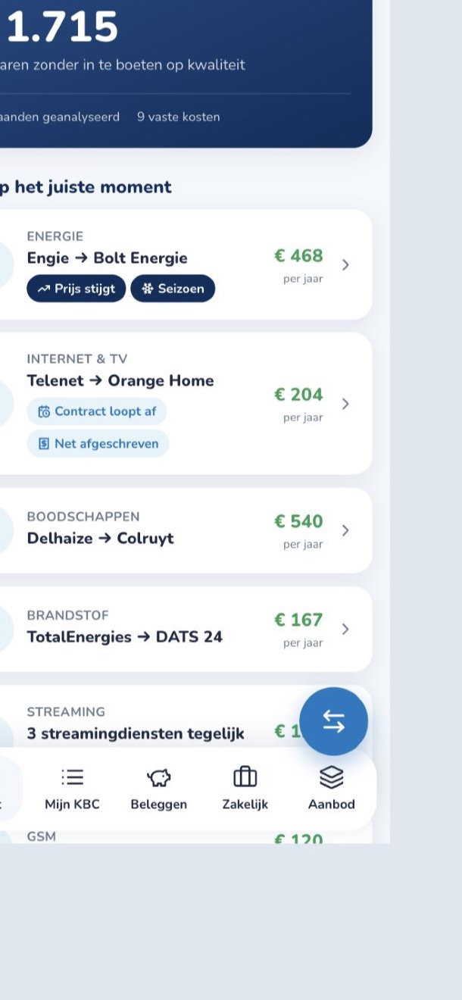
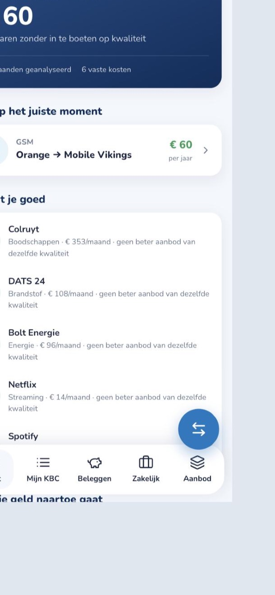

# Kate Switch — KBC knows what you pay, and tells you when it matters

> Hackathon prototype (Tectonic × KBC, Gent, 30 Sept 2026). Challenge: *understand what each customer needs and respond at exactly the right moment.*

Every KBC customer already tells the bank, month after month, where their money goes: energy, internet, mobile, insurance, groceries, fuel, streaming. **Kate Switch** turns that into a quiet, personal price-watch inside the KBC app. It builds a recurring-spend profile from the customer's own transactions, compares each fixed cost with the market, and only speaks up when three things are true at once:

1. there is a **cheaper alternative of comparable quality** (never "cheaper but worse"),
2. the saving is **worth an interruption** (≥ €50/year),
3. it is **the right moment** — the bill just went up, the contract turns one year old, the debit just landed, winter is coming, or two subscriptions overlap.

Everything is explainable ("Waarom zie ik dit?"), consent-based, and capped at one push a week. If a customer already has good deals, Kate says so and stays quiet.

   

## Demo

```bash
npm install
npm run dev          # API on :4000, KBC-styled app on http://localhost:5180
npm test             # engine tests (node:test)
```

Two demo personas (switch in *Instellingen*):

| Persona | Situation | What Kate does |
|---|---|---|
| **Thomas** | Engie bill crept from €142 → €168, Telenet contract turns 1 year in 4 weeks (and was debited 2 days ago), 3 streaming services, Delhaize shopper | Push: *"Bespaar zo'n €468 per jaar"* on energy (price creep + season). Overview lists 7 timed tips worth €1.715/yr. |
| **Lien** | Bolt energy, Colruyt, DATS 24, Orange | No push. "Hier zit je goed" for energy, groceries, fuel. One small mobile tip. |

Optional: put `ANTHROPIC_API_KEY` in `.env` and Kate rewrites each explanation in her own voice (Claude Opus 5.5) from the engine's facts only. Without a key the deterministic Dutch templates are used — the demo works fully offline.

## How it works

```
transactions ──► categorize ──► detectRecurring ──► detectMoments ─┐
   (KBC data)     (merchant       (cadence, avg,      (price creep,   │
                   catalog)        trend, months)      contract window,│
                                                       post-debit,     ├──► insights ──► rank ──► notification policy ──► app
                                       offers ──► bestAlternative ─────┘   (savings ×      (1/week, ≥€50/yr,
                                     (market feed)  (quality parity)        confidence ×    requires a live moment,
                                                                            timing)         honours snooze/dismiss)
```

`apps/api/src/engine/` — pure TypeScript, no framework, fully unit-tested (`engine.test.ts`):

| Module | Responsibility |
|---|---|
| `categorize.ts` | Merchant matching against a catalog (`data/merchants.ts`). Swap for KBC's classifier. |
| `recurring.ts` | One row per merchant: cadence (monthly/weekly), current price, 14-month history, trend (last 3 vs first 3 months). |
| `moments.ts` | The timing signals: `price_creep`, `contract_window`, `post_debit`, `seasonal`, `overlap`. Each adds relevance and a human reason. |
| `match.ts` | Best cheaper alternative with **quality parity** (`quality ≥ current − 0.3`). KBC partner offers get **no boost** (tested). Basket categories (groceries, fuel) use a price index instead of a flat price. |
| `insights.ts` | Builds insights, `relevance = min(1, savings/500) × confidence × (1 + Σ moment weights)`, and `pickNotification()` — the policy that decides *whether* and *what* to push. |
| `explain.ts` / `kate.ts` | Deterministic Kate copy; optional Claude rewrite with strict "facts only" system prompt and template fallback. |

`apps/api/src/routes/me.ts` — REST API, all routes scoped to the bearer token's own customer:

| Route | Purpose |
|---|---|
| `GET /api/me` | Profile, consent flag, demo date |
| `POST /api/me/consent` | Toggle analysis (everything below returns 403 without it) |
| `GET /api/me/spending` | Category breakdown + recurring costs |
| `GET /api/me/insights` | Ranked, explained insights |
| `GET /api/me/notification` | The one push Kate would send now, and *why* (or why not) |
| `POST /api/me/insights/:id/feedback` | `accept` / `snooze` (30 d) / `dismiss` — feeds back into ranking |
| `POST /api/me/notification/delivered` | Starts the 7-day cooldown |

`apps/web/` — React + Tailwind mock of the KBC Mobile app (Kate search bar, account cards, "Voor jou" feed, bottom nav) with the Kate Switch module: push banner, overview, insight detail with comparison + monthly chart + "Waarom zie ik dit?", settings with consent.

## Why this wins the challenge

- **Adapts to each customer's data** — profile is built from their own transactions; Lien and Thomas get completely different (or no) tips.
- **Right moment, not just right offer** — timing is a first-class signal in the ranking, and the notification policy is explicit and inspectable in Settings.
- **Trust by design** — quality parity, no partner bias, transparency panel, consent toggle, weekly cap, feedback loop.
- **Fits KBC** — built in the existing UX (Kate tip cards in "Voor jou", Kate as the voice), extends Kate's "No stress. Kate it." promise to fixed costs.

## Security

See [SECURITY.md](SECURITY.md). Summary: bearer-scoped routes (no ids in URLs), zod validation, helmet + CSP, rate limiting, no secrets in repo, data minimisation towards the LLM, 0 `npm audit` findings.

## Repo layout

```
apps/api   Express + TypeScript API and the analysis engine (+ tests)
apps/web   Vite + React + Tailwind KBC-styled app
docs/      Submission text, video script, screenshots
```
