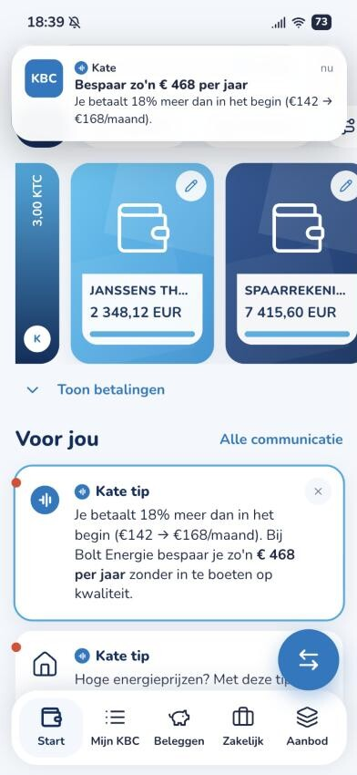
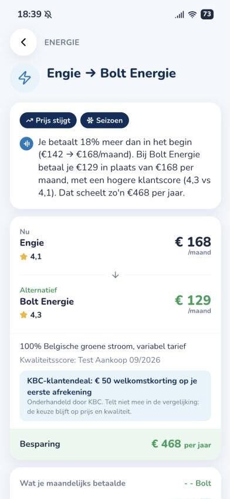
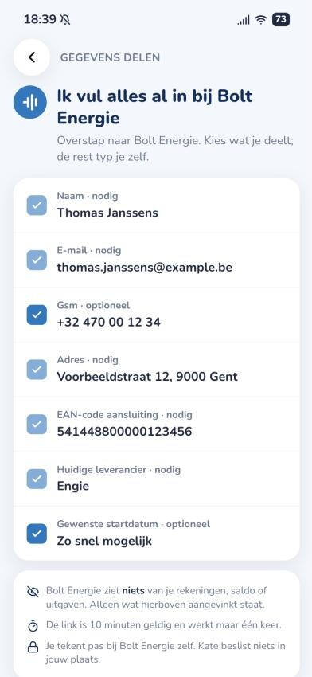
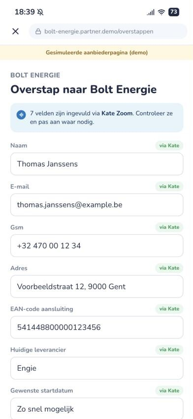
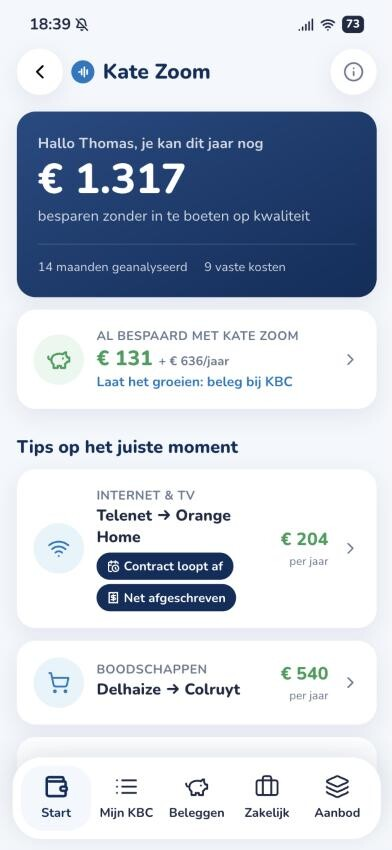
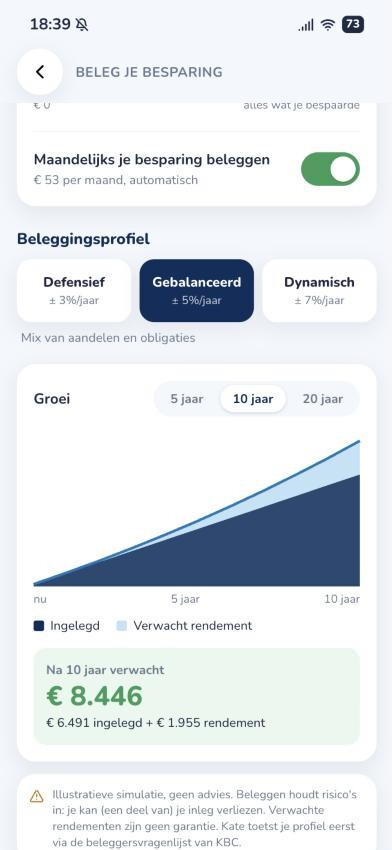
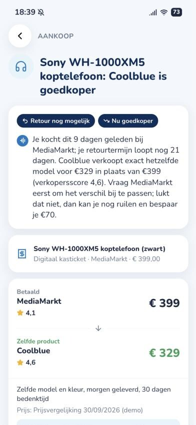

# Kate Zoom — KBC knows what you pay, and tells you when it matters

> Hackathon prototype (Tectonic × KBC, Gent, 30 Sept 2026). Challenge: *understand what each customer needs and respond at exactly the right moment.*
> All data in this repo is fictional.

Every KBC customer already tells the bank, month after month, where their money goes. **Kate Zoom** turns that into a quiet, personal price-watch inside the KBC app:

1. **Spot** — builds a recurring-spend profile from the customer's own transactions (energy, telecom, mobile, insurance, groceries, fuel, streaming) plus physical purchases from digital receipts.
2. **Time it** — only nudges when there is a cheaper alternative of *comparable quality*, the saving is worth an interruption, and it is *the right moment*: the bill crept up, the contract turns one year, the debit just landed, winter is coming, subscriptions overlap, or a product you just bought is cheaper elsewhere while you can still return it.
3. **Switch in one tap** — Kate prefills the provider's sign-up page with exactly the fields the customer approves, via a single-use 10-minute link. The provider never sees balances or spending.
4. **Grow it** — everything Kate Zoom saved is tracked and can be invested in a KBC risk profile, with a live projection of what it grows to.

Partners can offer exclusive **KBC-klantendeals**, shown transparently but excluded from the ranking, so the comparison stays on price and quality.

| | | | |
|---|---|---|---|
|  |  |  |  |
|  |  |  | |

## Run it

```bash
npm install
npm run dev          # API on :4000, KBC-styled app on http://localhost:5180
npm test             # 12 engine tests (node:test)
```

The step-by-step demo script is in **[DEMO.md](DEMO.md)**. Submission text and video script are in [docs/SUBMISSION.md](docs/SUBMISSION.md).

| Persona | Situation | What Kate does |
|---|---|---|
| **Thomas** | Engie crept €142 → €168, Telenet contract turns 1 year (debited 2 days ago), 3 streaming services, Delhaize shopper, bought €399 headphones 9 days ago | Push *"Bespaar zo'n €468 per jaar"* on energy. Overview with 8 timed tips, headphones €70 cheaper at Coolblue within the return window, €131 already saved. |
| **Lien** | Bolt, Colruyt, DATS 24 | No push. "Hier zit je goed" for energy, groceries, fuel. One small mobile tip that waits for a moment. |

Optional: `ANTHROPIC_API_KEY` in `.env` lets Kate rewrite each explanation in her own voice (Claude Opus 5.5) from the engine's facts only. Without a key the deterministic Dutch templates are used; the demo works fully offline.

## How it works

```
transactions ─► categorize ─► detectRecurring ─► detectMoments ─┐
receipts ─────────────────────► purchaseMatches ────────────────┤
offers / product prices ─► bestAlternative (quality parity) ────┴─► insights ─► rank ─► notification policy ─► app
                                                                                          │
                          accept ─► handoff (consent, single-use token) ─► provider page   │
                                 └► savings ledger ─► invest plan + projection ◄───────────┘
```

`apps/api/src/engine/` — pure TypeScript, no framework, unit-tested:

| Module | Responsibility |
|---|---|
| `categorize.ts` | Merchant matching against a catalog. Swap for KBC's own categorisation. |
| `recurring.ts` | Cadence, current price, 14-month history, trend per merchant. |
| `moments.ts` | Timing signals: `price_creep`, `contract_window`, `post_debit`, `seasonal`, `overlap`. |
| `purchases.ts` | Same EAN cheaper at a seller with score ≥ 4.0, only inside the receipt's return window. |
| `match.ts` | Best cheaper alternative with quality parity (`quality ≥ current − 0.3`). Partner offers and deals get no ranking boost (tested). |
| `insights.ts` | `relevance = min(1, saving/500) × confidence × (1 + Σ moment weights)` and `pickNotification()`: ≥ €50, 1 push per 7 days, **no moment → no push**, honours snooze/dismiss. |
| `handoff.ts` | Per-category prefill (EAN code, Easy Switch-ID, licence plate…), required vs optional fields, single-use 10-minute tokens. |
| `savings.ts` | Ledger of realised savings, run rate, and a monthly-compounding projection for three risk profiles. |
| `explain.ts` / `kate.ts` | Deterministic Kate copy; optional Claude rewrite with a facts-only prompt and template fallback. |

REST API (`apps/api/src/routes/`), all `/api/me` routes scoped to the bearer token's own customer:

| Route | Purpose |
|---|---|
| `GET /api/me` · `POST /api/me/consent` | Profile, opt-in toggle (everything below returns 403 without consent) |
| `GET /api/me/spending` · `GET /api/me/insights` | Category breakdown, ranked and explained tips |
| `GET /api/me/notification` · `POST /api/me/notification/delivered` | The one push Kate would send now and why, cooldown |
| `POST /api/me/insights/:id/feedback` | `accept` / `snooze` / `dismiss`; accept adds to the savings ledger |
| `GET/POST /api/me/insights/:id/handoff` | Preview the prefill, then create a single-use token for the approved fields |
| `POST /api/handoff/redeem` | Provider side: redeem the token once (410 when used or expired) |
| `GET /api/me/savings` · `POST /api/me/invest/projection` · `POST /api/me/invest` | Savings ledger, projection, start plan (capped at what Kate actually saved) |

`apps/web/` — React + Tailwind mock of the KBC Mobile app (Kate search bar, account cards, "Voor jou" feed, bottom nav) with the Kate Zoom module: push, overview, detail, consent, simulated provider page, invest.

## Business model

Customers save without comparing or filling in forms. KBC gets engagement and new recurring investment inflow. Partners (energy, telecom, retail) offer exclusive discounts to KBC customers and pay per switch; a prefilled, consented lead converts far better than an ad. Neutrality is a hard rule: deals are shown but never change the ranking.

## Security

See [SECURITY.md](SECURITY.md): bearer-scoped routes (no ids in URLs), consent gate, zod validation, helmet + CSP, rate limiting, single-use handoff tokens with field-level consent, data minimisation towards providers and the LLM, no secrets in the repo, 0 `npm audit` findings.

## Repo layout

```
apps/api   Express + TypeScript API and the analysis engine (+ tests)
apps/web   Vite + React + Tailwind KBC-styled app
docs/      Submission text, video script, screenshots
DEMO.md    Demo script for the presenter (Dutch)
```
